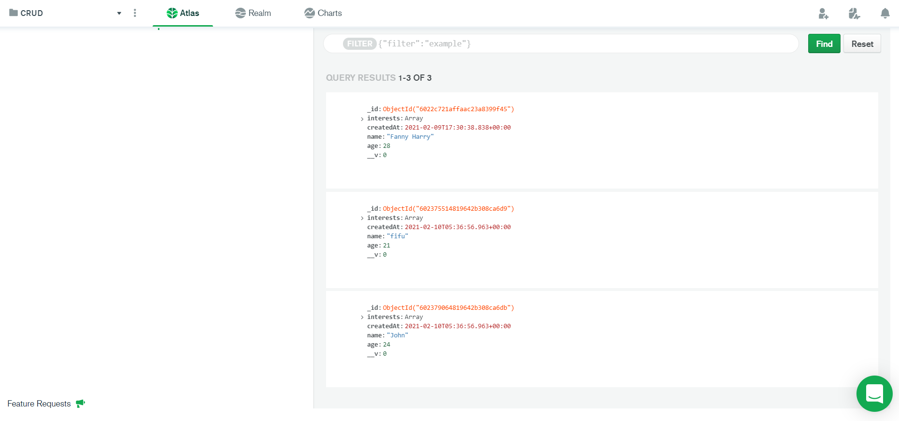
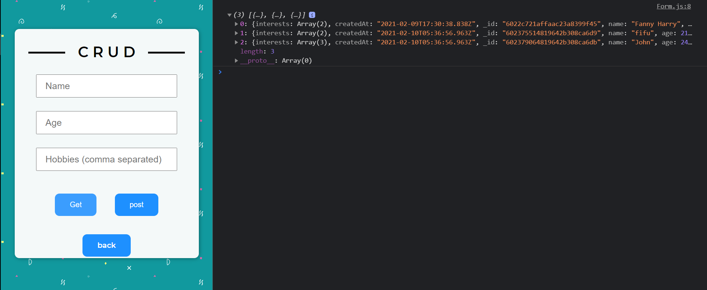
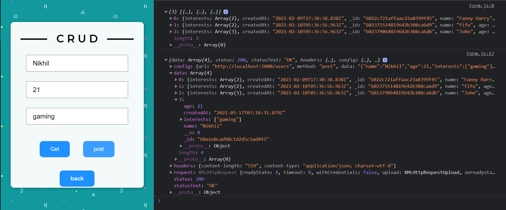
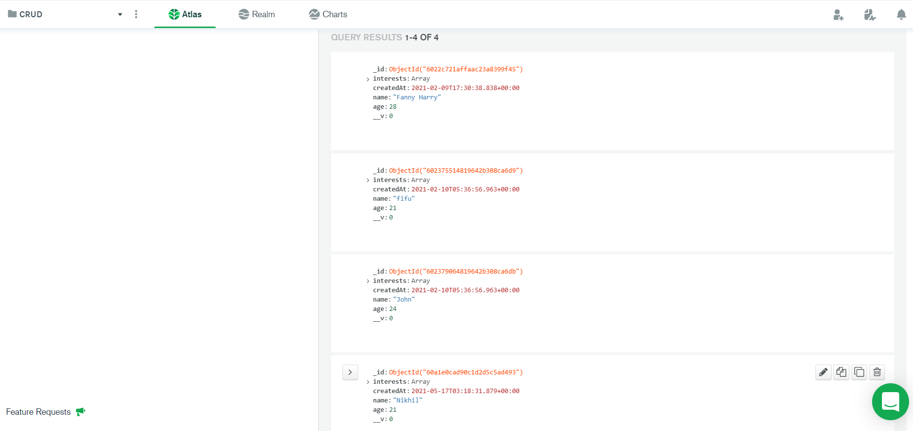

# CRUD

## About this app:

- This app is developed with the purpose to learn the basics of CRUD i.e. Create, Read, Update and Delete.

- Currently Create and Read feature has been implemented.

- All operations are synced with mongoDb atlas.

## Demo:

- MongoDB Atlas

  - Initial content of db:

    

- GET method

  - Click the "Get" button to retrieve data from db. Currently the data is being dumped into the console.

    

- POST method

  - Fill the form and click "Post" to create a new document in the db. After successful creation, the console gets updated with the documents.

    

- Verify

  - The db gets updated successfully:

    

## Tech used:

- [MongoDB Atlas](https://www.mongodb.com/cloud/atlas1)
- [expressjs](https://expressjs.com/)
- [reactjs](https://reactjs.org/)
- [nodejs](https://nodejs.org/en/)
